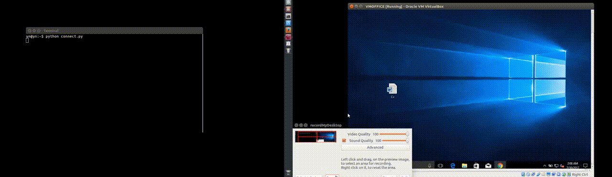
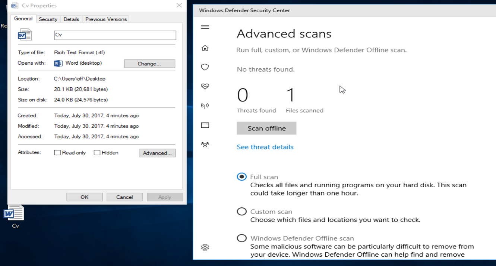
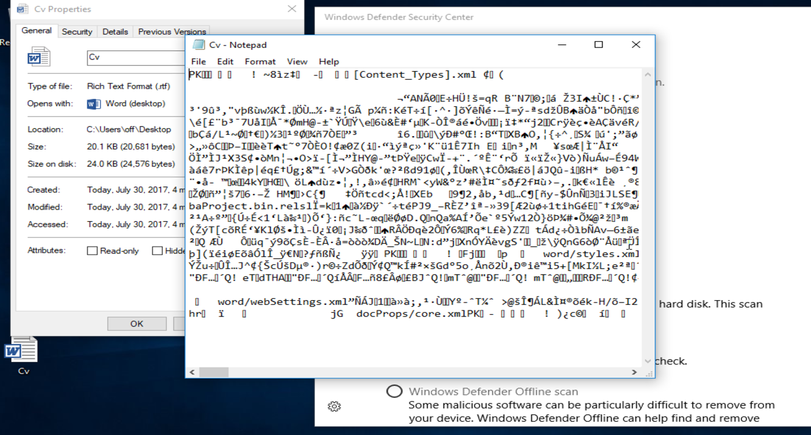
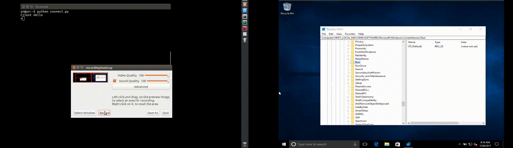

# Iris
# Intoduction: throw the entire repository i assume that any APT vendor will have the necessary equipment to implement this sort of attack vendor.
# Description
Iris is an adjudicational Trojan & a fullon RootKit, Targeting windows machine's, maid for Research purposes 
And as a resource Kit for ethical hackers.
we begin with delivery methods, anti-virus evastion and continue on to local acceleration of privileges in order to get a privileged persistent on the target machine. in this Repo we will try to simulate a full on root-kit throw hiding our persistence mechanism of action and simulating a real targeted campaign against any company or retailer.
i do not supply any binary's for any of the Rat components, nither forge certificate's or native executable's.
on the other hand i will try to give as much information as possible on how to avoid getting hit by this kind of exploit, and ll' try to supply as many open resources as possible to implement your own tool, for ethical hacking purposes, and for anti-virus software writers.
# Tech
# Packing:
this specific Kit is implemented as such to simulate a targeted campaign against a retaler or a comapny assuming that the company use default office product's. becouse of that, our main delivery method for this kit is throw the office api, i implement the payload as an rtf document but this can easily be deployed to any other type of document (s.t, xls, .doc etc..). i implement this specific payload as it do not requere any former preperation on the client side, and it is not recognized as a malware by the google mail (afaik), or most modern Av products.
in addition i will say that getting a Cv for a job application in the form of an rtf is an everyday harmless way to pack your payload, and any un-paranoid HR-person will likely to open the given document, in addition the mail display is not implemented on rtf as to .pdf documents in many browsers and mail providers, so its a good enough reason to download the document and to view it on the local machine. 
The .rtf itself contains a .vbe payload that will force winword.exe to download an encrypted zip folder that contains our installer & the native drivers. 
after download the script calls the decryptor with the decryption key and that executable extract's the intallation files to the target machine (in a writable location) to infect the target machine.
# Spec: view delivery section under the /src directory.
# Installer:
The first thing Our installer do is to bypass uac throw registry hijacking to trigger another executable that duplicates the system token and allows as to manipulate the target as NT Authority\System. in this kit we only utilize a uac bypass assuming that the target user is a member of the administative group, but we can easly exchange this mechanism of action to another LPE to support all test cases. see my "JailBreaks" repo for that. 
for Persistance on the target machine and to hide our activity we install a native driver that we will cover in the next sections and make some necessary changes to the target machine. all our payload files are places in the SysWow64 directory as to hide your activity (that targets specific x64 windows machine's) and to support most .NET components of the payload. as will be explained later on. 
after the installer is done it will kindly delete himself from the target machine and all other installation media to hide from debuggers and Av scanners. in addition throw the entire process i try to use as many native Windows API's as possible to avoid vertioning problems and Av detection at any phase of the rat action. 
Meaning that technically i load the driver with sc.exe i load my payload with sdclt and try to use as many native loaders to avoid detection & unnecessary and complex digital signiture's forgary or user interactions. 
In adition an important part of our persistent on the target machine is to hide our own activity, for that we try to avoid registry manipulation as far as possible and we use native API's to add exception's to our backdoors and C&C implementations. as to leave as little as possible sign's of our existance on the target machine.

# Av evasion
any modern anti-virus software makes use of the "reputational method" meaning that evan if your payload is succesfully signed by a root spc authorety it doesn't necessarily mean that the target machine will execute the given payload simply because the reputation of your software is not recognized by the Av users compunity and as such may be blocked by any Respectfull Av campaign. becouse of that we target two native's WinWord that is white listed to execute nay vbscript (i will explain why i use this native and not powershell). and WScript engauine to execute our Eop, after Eop we have the necessary permissions to execute any given software w/o any Av interference.

# There Are Two Options to Execute your payload and bypass all Av software. (afaik)...
One -> Execute an rtf working under winword. 
Second -> Execute a sign VBE (simply because a script do not hold reputation, so open file will not block your application due to signature and the Av will not recognize a bad reputation simply cuz this is a vbe...).
i will point out that if you are working under windows 10 build 14 and lower, there exist a possibility of packing your payload inside a signed .cab file (for open file warnings), or simply using .hta application that (for some reason), on that older win builds do not suffer the open file or Av detection at any given time, but in this Repo we utilize the .rtf described above.

# Persistance & Avoiding detection.
one thing we really dont want to do is to place Registry keys for Our persistence. because of that (and to gain the possibility to inject our C&C to native applications) we install a native driver and load it as an auto load driver that means that evan if the user will not sign into the machine it will be loaded placing registry entry's under RunOnce that will be automaticlly erased after logon. that way we do not leave any registry keys pointing out to our C&C. 
In addition the driver can reinstall the software if the user removes the installation components, meaning that only a format can clean the infected machine. 
In addition our installer place the entire C&C media inside the system directory's for further evading detection. Another mechanism that we implement to achive yet another persistent method is to erase the native Runonce executable so we can make the driver load any registry entry's under runonce and our native will be called instead of the native application loading our payload everytime the user logs into the local installation. Redundant to say the tyhe driver will be loaded evan if using safe-boot, and our entire installation media is replacing the native operating system components so such a "safe-boot" recovery is not an option for removing the Rat.
# Addendum
The source code is given asw is without any warranty you can copy redistribute and you do not have to point to this repository while you do so, this repository was made for educational purposes, i will not help anyone to compile the given code or to test it at any case i will answer Q about this project in my mail box that is referanced in my profile details. i hope you the reader will make good use of this repository and i am open to any further suggestions or questions about it.
In addition i will try to detail every step of making the software inside the given code sections of each individual component.
# Building The Executables
you will need WDK, VS 2015 & VS 2017.

# Tested On Latest Windows and office & against the latest anti-virus software & email delivery retailers, and to the date given:
# 1/8/2017
# Notes: This Rat Do not support smart firewall campaigns and as such do not utilize any UDP packets to the root c&c server.
# Proof Of Concept

# Delivery

# Av
# No threats detected & No FireWall Block or user interactions.

# Persistence
# No Registry

# Not Operating From User Land & and the user don't need to be the domain admin.

